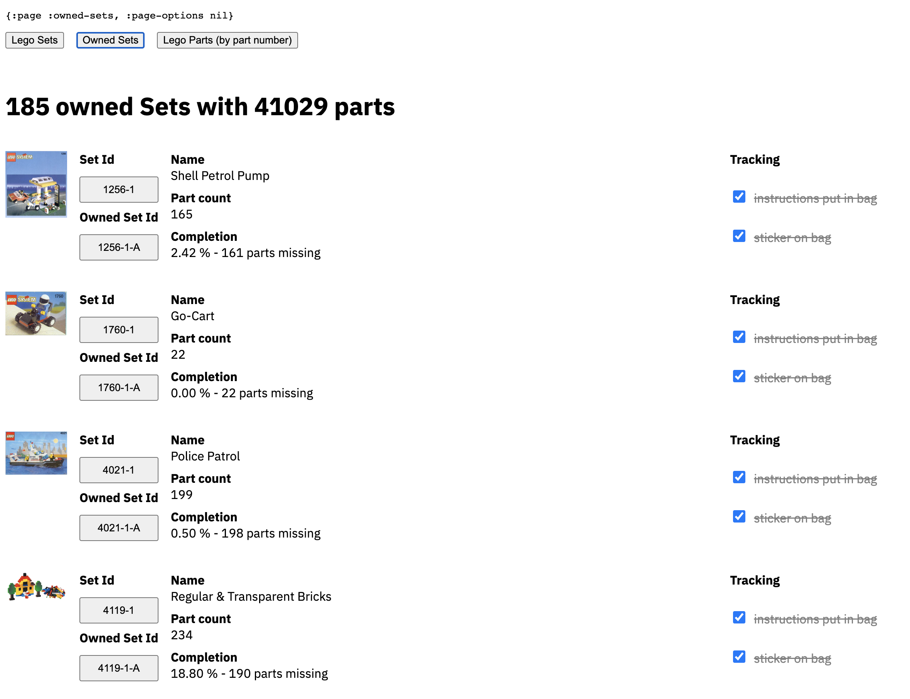

# a LEGO inventory app



This repo is a work in progress.

## Parts

**index**

The application allowing for sets to be entered. It'll then fetch the parts & auxiliary information from rebrickable and stores it.

**microcontroller_cpp**

The bare mininmum of C++ code for an ESP32-Wrover to allow for controlling servos and stepper motors via a JSON API.

**orchestrator**

The orchestrator talks to the controllers to control servos and stepper motors to capture pictures of parts going past and select in which buckets they'll be sorted.

**camera**

Documentation on the cameras used for the piece detection


## Shell commands

Record images from the main camera and store them into the `photos` directory

```bash
cd orchestrator
clj -m record
```

Turn the photos into a video

```bash
cd orchestrator/
cat photos/*.jpg | ffmpeg -framerate 6 -f image2pipe -i - -c:v libx264 -r 30 -pix_fmt yuv420p output.mp4
```
